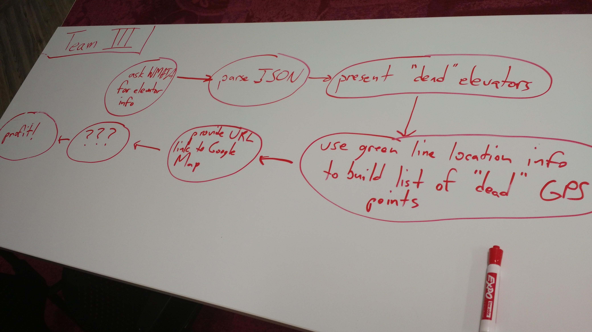

# "Map the green line stations with broken elevators"

This is a rough attempt at mapping WMATA green line stations by elevator operational status in Python for a Python Dojo event. The script uses `requests`, creatively hinges on the meaning of a `map`, and should produce results like this:

```
Mt Vernon Sq 7th St-Convention Center (38.905604, -77.022256)
Shaw-Howard U (38.912919, -77.022194)
U Street/African-Amer Civil War Memorial/Cardozo (38.916489, -77.028938)
Columbia Heights (38.928672, -77.032775)
Georgia Ave-Petworth (38.936077, -77.024728)
Fort Totten (38.951777, -77.002174)
West Hyattsville (38.954931, -76.969881)
Prince George's Plaza (38.965276, -76.956182)
College Park-U of MD (38.978523, -76.928432)
Greenbelt (39.011036, -76.911362)
Gallery Pl-Chinatown (38.89834, -77.021851)
Archives-Navy Memorial-Penn Quarter (38.893893, -77.021902) ELEVATOR BROKEN :(
L'Enfant Plaza (38.884775, -77.021964)
Waterfront (38.876221, -77.017491)
Navy Yard-Ballpark (38.876588, -77.005086)
Anacostia (38.862072, -76.995648)
Congress Heights (38.845334, -76.98817)
Southern Avenue (38.840974, -76.97536)
Naylor Road (38.851187, -76.956565)
Suitland (38.843891, -76.932022)
Branch Ave (38.826995, -76.912134)
```

Note that only the elevator at Archives is broken at press time.

## Planning


